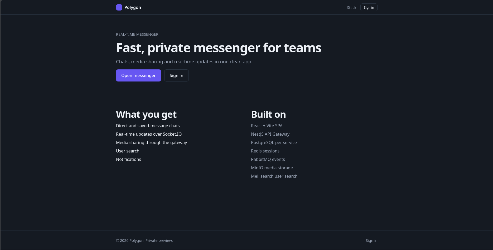
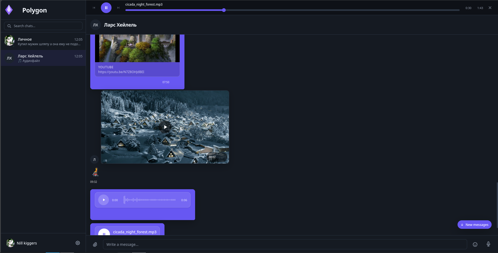
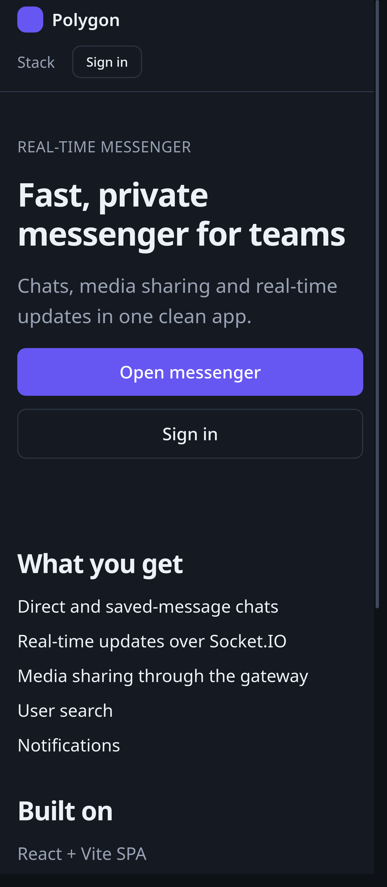
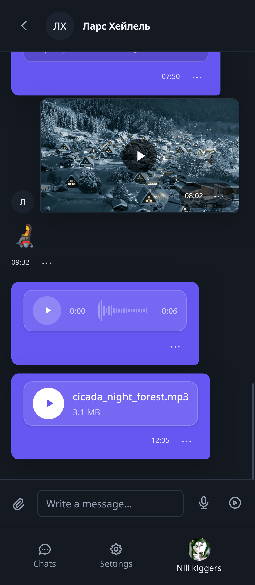

# Polygon — Fast, Private Messenger for Teams

Developed by **Igor Shevchenko**.

## Overview

Polygon is a real-time messenger monorepo (Nx): chats, media sharing and real-time updates in one clean app.

- Landing page as start page for guests with sign-in entry.
- Direct and saved-message chats, user search, notifications.
- Real-time updates over Socket.IO, media sharing through the NestJS API Gateway.

See full feature walkthrough: [docs/FEATURES.md](docs/FEATURES.md).

### Landing — Desktop

### Messenger — Desktop

### Landing — Mobile

### Messenger — Mobile

## Tech Stack

**Frontend (`apps/client/*`, `libs/client/*`)**

- React 19 + Vite 7 SPA, React Router 7, Zustand, TanStack Query / Virtual
- Tailwind CSS v4, Socket.IO client, MSW mocks, Storybook, Vitest / Jest

**Backend (`apps/backend/*`, `libs/backend/*`)**

- NestJS 11 API Gateway + microservices: auth, user, chat, media, notification, search
- Database-per-service via Prisma + PostgreSQL 17, Redis 7 sessions
- RabbitMQ events, Socket.IO WebSockets, MinIO media storage, Meilisearch user search
- OpenTelemetry + Pino logging, Swagger docs, Jest / Supertest

**Platform / Workspace**

- Nx 22 monorepo, TypeScript 5.9, ESLint + Prettier
- Docker Compose: Postgres, Redis, MinIO, RabbitMQ, Meilisearch
- Observability: Prometheus, Grafana, Loki, Tempo, Alloy + exporters

## Documentation

- [Features — detailed overview](docs/FEATURES.md)
- [Architecture](docs/ARCHITECTURE.md)
- [Development Guide](docs/DEVELOPMENT.md)
- [Monorepo Gotchas](docs/MONOREPO_GOTCHAS.md)
