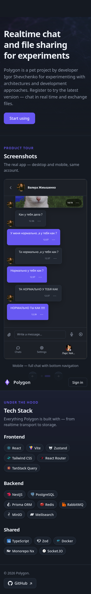
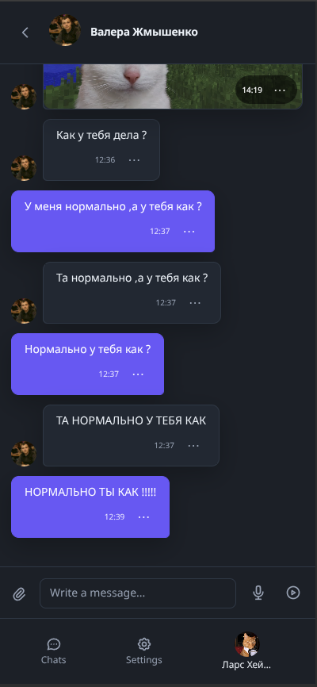

# Polygon — Fast, Private Messenger for Teams

Developed by **Igor Shevchenko**.

## Tech Stack

**Frontend (`apps/client/*`, `libs/client/*`)**

| | Technology | Purpose |
|---|---|---|
| ⚛️ | React 19 | UI library |
| ⚡ | Vite 7 | Build tool, SPA |
| 🧭 | React Router 7 | Routing |
| 🐻 | Zustand | Client state |
| 🔄 | TanStack Query / Virtual | Server state, virtualized lists |
| 🎨 | Tailwind CSS v4 | Styling |
| 🔌 | Socket.IO client | Realtime transport |
| 📚 | Storybook | UI kit docs |
| 🧪 | Vitest / Jest | Testing |

**Backend (`apps/backend/*`, `libs/backend/*`)**

| | Technology | Purpose |
|---|---|---|
| ⬢ | NestJS 11 | API Gateway + microservices: auth, user, chat, media, notification, search |
| 🐘 | PostgreSQL + Prisma | Database-per-service |
| 🟥 | Redis | Sessions, cache, presence |
| 🐇 | RabbitMQ | Events between services |
| 🔌 | Socket.IO | WebSockets |
| 🗄️ | MinIO | S3-compatible media storage |
| 🔍 | Meilisearch | User search |
| 📊 | OpenTelemetry + Pino | Tracing, logging |
| 📖 | Swagger | API docs |
| 🧪 | Jest / Supertest | Testing |

**Platform / Workspace**

| | Technology | Purpose |
|---|---|---|
| 🧩 | Nx 22 | Monorepo |
| 📘 | TypeScript | Language |
| ✨ | ESLint + Prettier | Lint, format |
| 🐳 | Docker Compose | Postgres, Redis, MinIO, RabbitMQ, Meilisearch |

## Screenshots

### Landing

<table>
  <tr>
    <td></td>
    <td></td>
  </tr>
</table>

### Messenger

<table>
  <tr>
    <td></td>
    <td></td>
  </tr>
</table>

## Documentation
- [Architecture](docs/ARCHITECTURE.md)
- [Development Guide](docs/DEVELOPMENT.md)
- [Monorepo Gotchas](docs/MONOREPO_GOTCHAS.md)
