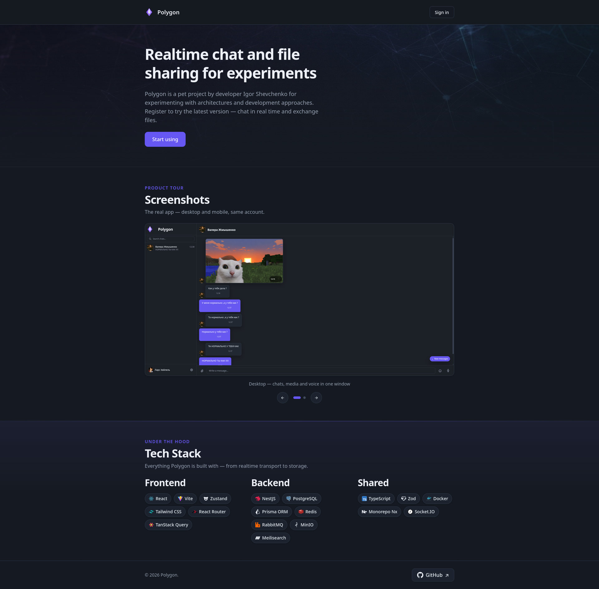
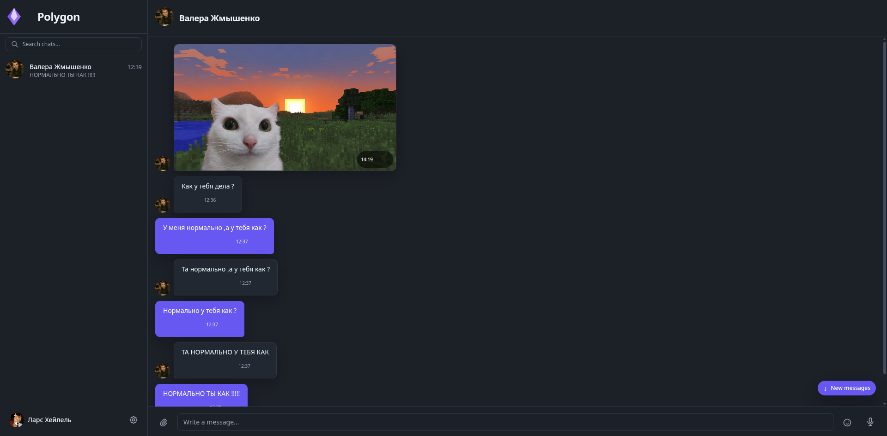

# Polygon — Fast, Private Messenger for Teams

Developed by **Igor Shevchenko**.

## Tech Stack

> Everything Polygon is built with — from realtime transport to storage.

| Frontend | Backend | Shared |
| :--- | :--- | :--- |
| • **React** — UI library • **Vite** — Build tool • **Zustand** — Client state • **Tailwind CSS** — Styling • **React Router** — Routing • **TanStack Query** — Server state | • **NestJS** — API framework • **PostgreSQL** — Database • **Prisma ORM** — ORM • **Redis** — Cache • **RabbitMQ** — Message broker • **MinIO** — S3-compatible files • **Meilisearch** — Search engine | • **TypeScript** — Language • **Zod** — Contracts • **Docker** — Containers • **Monorepo Nx** — Monorepo • **Socket.IO** — Realtime transport |
## Screenshots

> 📱 All screens, including mobile views, are available in the [docs/screenshots/app](docs/screenshots/app) folder.

### Landing

### Messenger

## Documentation

- [Architecture](docs/ARCHITECTURE.md)
- [Development Guide](docs/DEVELOPMENT.md)
- [Monorepo Gotchas](docs/MONOREPO_GOTCHAS.md)
