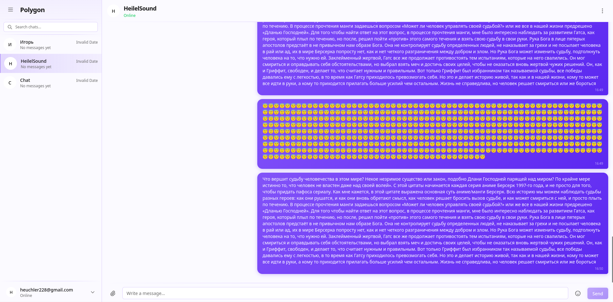
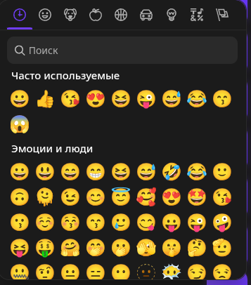
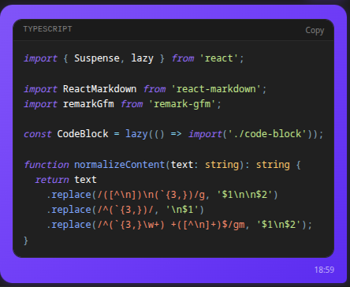

# Messenger

---

## Tech Stack

### Frontend

- **Core:** React 19 (SPA)
- **Build Tool:** Vite
- **State Management:** Zustand
- **Data Fetching:** TanStack Query v5 (React Query)
- **Routing:** React Router 7
- **Forms & Validation:** React Hook Form + Zod
- **Styling:** Tailwind CSS 4, class-variance-authority (CVA), tailwind-merge
- **UI Components:** Sonner (notifications), Emoji Mart (emojis), React Syntax Highlighter
- **Virtualization:** React virtuoso

### Backend

- **Framework:** NestJS
- **Real-time:** Socket.io (WebSockets)
- **Database (ORM):** Prisma
- **Messaging & Queues:** RabbitMQ (Amqp)
- **Caching & Sessions:** Redis (ioredis)
- **Auth:** Passport.js (JWT, OAuth: Google, GitHub, Yandex)
- **Search Engine:** Meilisearch
- **Validation:** nestjs-zod
- **Emails:** react-emails,nodemailer

### Infrastructure & Tooling

- **Monorepo Management:** [Nx](https://nx.dev)
- **Testing:** Vitest, Jest, Playwright (E2E), MSW (Mock Service Worker)
- **Logging & Monitoring:** Pino, Prometheus, OpenTelemetry
- **Linting & Formatting:** ESLint, Prettier
- **Documentation:** Storybook, Swagger (OpenAPI)

---

## Features Implemented

**Authentication**

- Registration and Login via email + password.
- OAuth — GitHub, Google, Yandex.
- Password reset and email confirmation (UI).
- Cookie-based sessions with automatic token refresh.

**Chats & Messaging**

- Sidebar chat list.
- Chat creation via user search.
- Message history.
- **Cursor pagination + Infinite scroll + vitrual list** (seamless history loading).
- Real-time message sending and receiving.
- **Emoji picker** (inserting emojis into messages).

**Notifications & API**

- **Browser Notification API**: pop-up notifications in the browser.
- **Sound Alerts**: audio signals for incoming messages.

**UI/UX**

- Dark / Light theme support.
- User Profile (modal window).
- Responsive design (Mobile/Desktop).
- Custom 404 page.

---

## Placeholders (UI exists, functionality pending)

| Page / Feature  | Status                     |
| --------------- | -------------------------- |
| Settings        | Empty placeholder screen   |
| Profile Editing | Modal without saving logic |
| Avatar          | System placeholder         |

## Screenshots

### Desktop Version

| Light Mode                                                                   | Dark Mode                                                                                         |
| :--------------------------------------------------------------------------- | :------------------------------------------------------------------------------------------------ |
|                    |                                  |
| Features:                                                                    |
| Emoji picker for desktop                                                     | Markdown transformation and syntax highlighting. Wrap your text in triple backticks (```) to use. |
|  |                                 |
