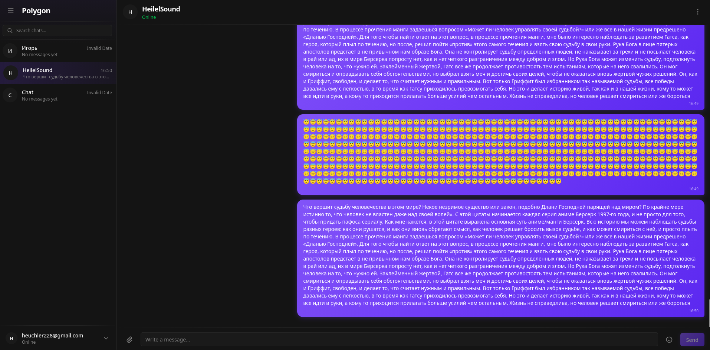

# Messenger

React 19 SPA — клиентское приложение платформы Polygon.

---

## Реализовано

**Аутентификация**

- Регистрация, вход по email + пароль
- OAuth — GitHub, Google, Yandex
- Сброс пароля и подтверждение email — страницы есть, backend не протестирован
- Cookie-сессия, автообновление токена

**Чаты**

- Список чатов в боковой панели
- Создание чата через поиск пользователя
- История сообщений (загружается целиком, пагинации нет)
- Отправка сообщений в реальном времени
- Получение входящих сообщений без перезагрузки

**UI**

- Тёмная / светлая тема
- Профиль пользователя (модалка)
- 404 страница

---

## Заглушки (UI есть, функционала нет)

| Страница / фича        | Состояние                |
| ---------------------- | ------------------------ |
| Settings               | Пустой экран-placeholder |
| Редактирование профиля | Модалка без сохранения   |
| Аватар                 | Нет                      |

---

## В разработке

Полный roadmap с деталями реализации — [`Todo.md`](../../Todo.md).

| #   | Фича                                  | Сложность |
| --- | ------------------------------------- | --------- | ------ |
| 1   | Emoji picker                          | 🟢        | Готово |
| 2   | Markdown + подсветка кода             | 🟢        |
| 3   | Soft delete сообщений/пользователей   | 🟢        |
| 4   | Редактирование и удаление сообщений   | 🟢        |
| 5   | Курсорная пагинация + infinite scroll | 🟡        | Готово |
| 6   | Виртуализация списков                 | 🟡        |
| 7   | Аватар пользователя                   | 🟡        |
| 8   | Блокировка пользователей              | 🟡        |
| 9   | Read status / непрочитанные           | 🟡        |
| 10  | Файлы и изображения в чате            | 🟡        |
| 11  | Реакции на сообщения                  | 🟡        |
| 12  | Онлайн-статус + push-уведомления      | 🔴        |
| 13  | Групповые чаты                        | 🔴        |
| 14  | Голосовые звонки 1-на-1 (WebRTC)      | 🔴        |
| 15  | Система дружбы                        | 🔴        |
| 16  | Групповые звонки                      | 🔥        |

---

## Скриншоты

