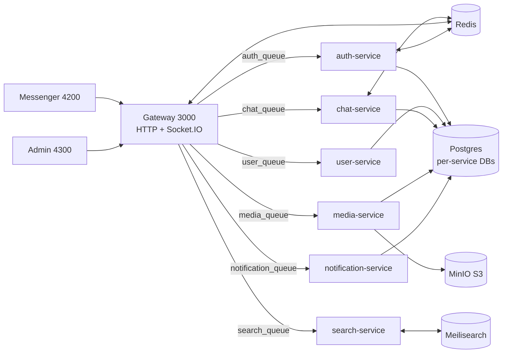

# Architecture

## 1. Overview

Polygon is an Nx monorepo real-time messenger. Clients talk only to the NestJS **API Gateway**
(HTTP `api/*` + Socket.IO). The Gateway fans out to six RabbitMQ microservices and owns
cookies/session enforcement, WebSocket rooms/presence, and read-through Redis caching.

- Sync Gateway→service calls use RMQ request/reply (`client.send(PATTERN, payload)`).
- Fire-and-forget side effects use RMQ events (`client.emit(EVENT, payload)`), e.g. index updates, emails, push.
- Each `apps/backend/*-service/src/main.ts` runs `connectMicroservice({ transport: RMQ, queue })` and also
  listens on a metrics port scraped by Prometheus.

## 2. Backend Services

| Service | Queue | Owns |
|---|---|---|
| `auth-service` (`libs/backend/auth`) | `auth_queue` | Credentials, OAuth (GitHub/Google), sessions, bans, roles |
| `user-service` (`libs/backend/user`) | `user_queue` | User profiles; emits `user.registered/updated/deleted` |
| `chat-service` (`libs/backend/chat`) | `chat_queue` | Chats, members, messages, forwards, read state, attachment access checks |
| `media-service` (`libs/backend/media`) | `media_queue` | Upload init/confirm, MinIO files, avatars, link previews (gateway fetches), history |
| `notification-service` (`libs/backend/notification`) | `notification_queue` (events only) | Verification/password emails (Nodemailer), WebPush subscriptions + send |
| `search-service` (`libs/backend/search`) | `search_queue` | Meilisearch user index; syncs on user events |

Pattern/token constants live in `libs/backend/core/src/constants/queues/*.queue.ts` and
`libs/backend/core/src/constants/di/*.di.ts`. Shared zod contracts live in `libs/common/src/schemas/*`.

## 3. Gateway

`apps/backend/gateway/src/app/gateway.module.ts` wires six RMQ clients, Redis, MinIO, JWT/session
guards, throttling (60s/100), and Swagger at `api/docs` (cookie auth `access_token`).

- `main.ts`: global prefix `api`, CORS `CLIENT_URL` with `credentials: true`, `cookieParser()`,
  `ZodValidationPipe`, `GatewayHttpExceptionFilter` + `ZodValidationExceptionFilter`.
- Proxy idiom in every HTTP controller: `lastValueFrom(client.send(...))`, map RPC errors to
  `HttpException(message, status)`.
- Controllers: `auth` (register/login/logout/refresh/verify/forgot/reset/OAuth/sessions),
  `chats`, `users`, `media`, `search`, `notifications/push`, `admin` (creator/admin only),
  `frontend-error`.
- Auth cookies: HttpOnly `access_token` + `refresh_token`, `SameSite=strict`, `secure` in prod only.
- Chat reads use `GatewayChatCacheService`: read-through Redis `chat:list:{userId}` (30s) and
  `chat:msgs:{chatId}:*` (60s) with `X-Cache` HIT/MISS headers and silent Redis fallback.

## 4. Session / Auth Flow

- Tokens: `CoreTokenModule` issues `JwtPayload { sub, role, isVerified, sessionId, jti }` with separate
  access/refresh secrets and expiries; every access/refresh pair gets a fresh `jti`.
- Login: `LocalGuard` validates credentials (`auth.validate-credentials`, 5-attempt Redis limit) →
  `auth.login { id, clientMetadata }` creates `sessionId`, stores `sha256(refresh)` in Prisma `Session`
  + Redis session cache, sets the cookie pair.
- Request auth: `SessionGuard` verifies the `access_token` JWT **and** Redis session existence (401 if
  missing); `ActiveAccountGuard` checks Redis `ban:{userId}` (403 `ACCOUNT_BANNED`).
- Refresh rotation: verify refresh JWT → look up by token hash → reuse detected ⇒ revoke-all → rotate
  hash + Redis TTL + `lastActiveAt`, set new cookies.
- Logout/revoke/reset rotate through `auth.logout / revoke-session / revoke-all-sessions`; admin
  ban sets the Redis ban marker, revokes sessions, and disconnects sockets via
  `chatGateway.disconnectUser(targetId)`.

## 5. Realtime and Events

`gateways/chat.socket-gateway.ts` (`@WebSocketGateway`, CORS `CLIENT_URL`, credentials):

- Connect: parse `access_token` cookie → verify JWT → ban check → track `userSockets`, Redis
  `presence:{userId}` (EX 120), join `chat:{id}` rooms via `chat.getChats`, emit `user:online`.
- `message:send`: zod-validate → membership check → `chat.sendMessage` → `server.to(chat:{id}).emit('message:new')`
  → push to offline members → invalidate chat cache.
- Offline push: resolve members + sender name, skip online users (`exists presence:*`), emit
  `notification.send-push { userId, title, senderName, body, tag: chatId, eventType: MESSAGE }`.
- Typing: Redis `typing:{chat}:{user}` (EX 3s) + `user:typing` events; `message:updated/deleted`,
  `user:online/offline`, and `message:send:error` complete the protocol.
- Cross-service events: `user.registered/updated/deleted` keep Meilisearch in sync;
  verification/password emails and push subscribe/unsubscribe are pure RMQ events.

## 6. Data

- **Postgres 17, database-per-service on one instance**: `polygon_auth/user/chat/media/notification`
  (+ base `polygon`), created by `infra/db/init/01-create-databases.sql`. Each backend lib owns
  `src/database/prisma/schema.prisma` + `PrismaService` + repository (auth credentials/sessions,
  users, chats/members/messages/attachments/forwards, files/references, push subscriptions).
- **Redis 7**: sessions, ban markers, login-attempt counters, presence, typing, gateway chat cache.
- **MinIO**: `avatars/{sub}/{uuid}` and chat attachments; content streamed with ETag/Range/cache headers.
- **Meilisearch**: `{ id, name, displayName, avatarUrl }` user index; `search.users`, `reindexUsers`.

## 7. Frontend

- Apps: `apps/client/messenger` (port 4200) and `apps/client/admin` (port 4300, base `/admin/`);
  both Vite-proxy `/api` and `/socket.io` (ws) to Gateway `:3000` in dev.
- Structure: Feature-Sliced Design across `libs/client/*` sliced packages (`@org/*`):
  `entities` (chat, message, user, admin), `features` (auth, chat-socket, send-message, search,
  notifications, …), `pages/*` (messenger, auth, admin, system/landing), `layouts`, `shared`
  (api client, query client, socket singleton, UI kit). No `widgets/` layer.
- State: Zustand (+persist/selectors) for ephemeral state (session, active chat, typing, presence,
  audio, notifications); single shared React Query client (`retry: 1`, `staleTime: 30s`) for server state.
- Socket: `shared/lib/socket/socket.ts` singleton (`io(origin, { autoConnect: false, withCredentials: true })`);
  `socket-middleware` connects on auth, rejoins chats, and `chat-socket-manager` patches
  `['messages', chatId]` / `['chats']` caches on `message:new/updated/deleted`, presence, typing.
- HTTP: `shared/lib/api/client.ts` + `authed-fetch.ts` (`credentials: include`, 401 ⇒ single-flight
  `auth.refresh` retry), all routes via `API_ROUTES` from `@org/common`.

## 8. Platform

- **Nx 22**: `enforceModuleBoundaries` — `entities/features` cannot import `widgets/pages/layouts`,
  `layouts` cannot import `pages`, `shared` cannot import upper layers, `scope:client` ↔ `scope:backend`
  isolation; `build` depends on `^build + ^prisma-generate`.
- **NPM only**: source of truth is `package-lock.json`; do not use pnpm/yarn/bun (see `AGENTS.md`).
- **Compose (dev, `172.20.0.0/16`)**: postgres 5432, redis 6379, minio 9000/9001, rabbitmq 5672/15672,
  meilisearch 7700, prometheus 9090, grafana 3009→3000, loki 3100, tempo 3200, alloy OTLP 4317/4318.
- **Observability**: Prometheus scrapes Gateway `/api/metrics` + services `/metrics` + node/cadvisor/
  postgres/redis exporters; Alloy ships OTLP traces → Tempo and Docker logs → Loki; Grafana provisions
  Prometheus/Loki/Tempo with `polygon-backend-overview` dashboards.
- **Demo (prod-like)**: `docker/demo` builds one Node image running all 7 `dist/main.js` behind nginx,
  `start.sh` runs `prisma migrate deploy` per service before launch.
