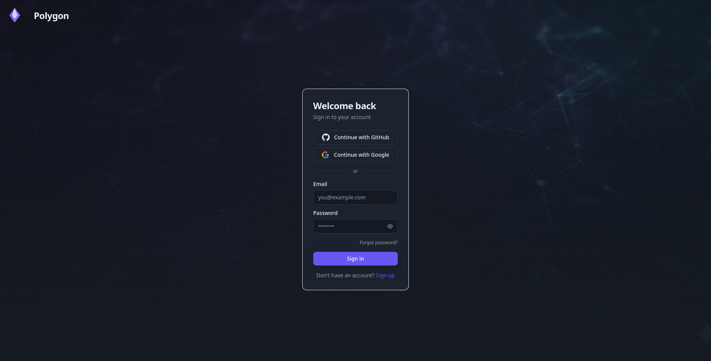
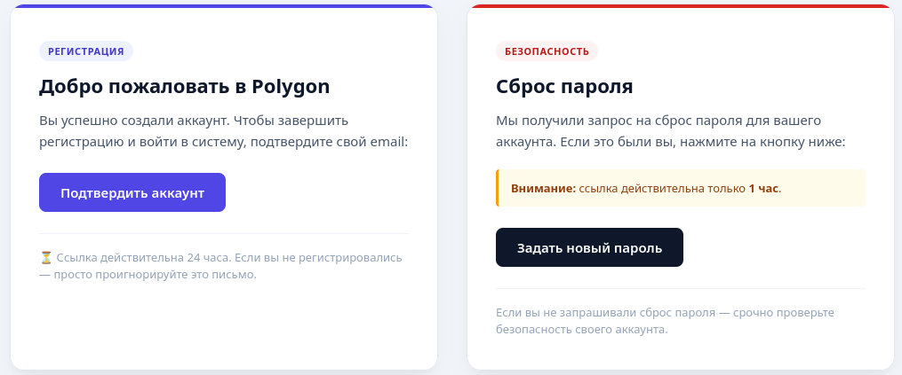
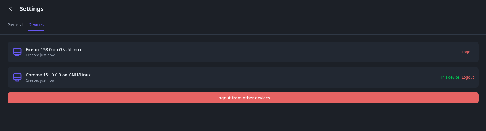
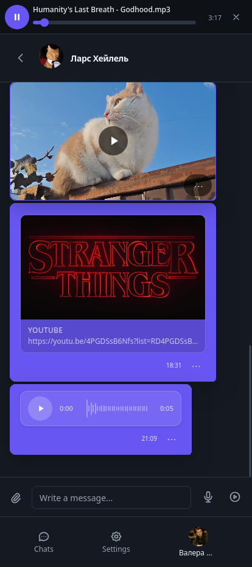
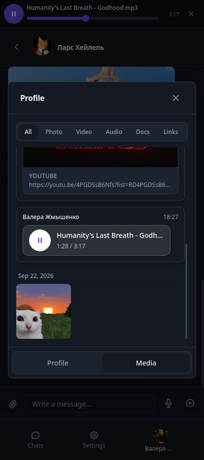
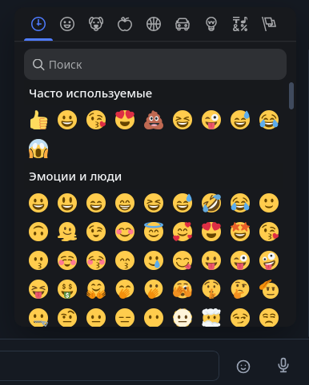
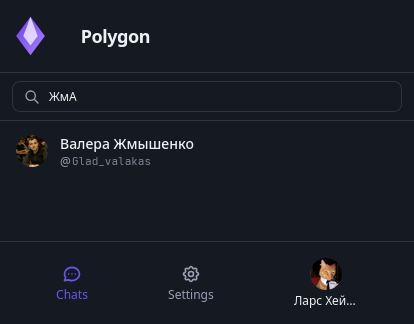

# Auth — what's included

## Sign in and sign up

Classic manual sign-up: pick a name, email and password, hit the button — and you're in.

You can't sign in right after sign-up — you need to verify your email first. Without verification login just won't let you in and will ask you to check your inbox.

## Emails

We send emails ourselves through our own mail module on nodemailer (SMTP). Here's what a letter from us looks like:

What emails we have:

- email verification after sign-up — the link lives for 24 hours;
- password reset — the link lives for 1 hour;
- resend the letter if the first one got lost or expired.

If mail isn't configured or fails — sign-up still succeeds, the letter just won't arrive. We log the error, we don't fail the user.

About retries in simple words: the "send again" button can't be pressed more often than once a minute — that's our spam protection. The old link burns when you resend, only the new one works. Password can't be brute-forced either: after 5 wrong attempts login is locked for 15 minutes.

## Forgot password

It's the classic flow:

1. you enter your email on the "forgot password" page;
2. if we have that email — a link arrives;
3. you follow the link and set a new password;
4. after changing the password you're logged out everywhere — you need to sign in again on all devices. That's for safety, in case the password was stolen.

We deliberately answer the same way whether the email exists or not — so a stranger can't probe who's registered here.

## Sign in with Google and GitHub

You can skip the password and sign in in one click with Google or GitHub.

How it feels: press the button → you go to Google/GitHub → allow access → you're brought back already signed in.

No need to verify email in that case — if Google already checked it, we trust it. If it's your first time — we just create an account for you; if that email was already here — we link the button sign-in to it.

## My devices and per-device logout

You can be online from several places at once: phone, laptop, second browser — everything works in parallel, sessions don't kick each other out.

In settings there's a "my devices" list: you see where you're signed in, from which browser, and when it was last active, the current device is marked.

What you can do:

- log out just on this device;
- kick one specific other device (e.g. forgot to log out at work);
- press "log out everywhere except this one";
- change your password — it kicks you out absolutely everywhere.

Bottom line: plain sign-up with emails, password reset, sign-in with Google/GitHub, plus proper multi-device — sit wherever you want and close any single device on demand.

## Messenger

Plain chat with one person, like in any messenger. No reload button — new messages just appear by themselves.

How it feels: you open a chat → you write → the other person answers → their bubble pops up right away, you don't need to refresh anything. Opened the chat — it counts as read.

### Missed messages and notifications

You don't need to sit in every chat. The list on the left always shows who wrote last and when, and if you missed something — a blue circle with a number.

How it feels:

- you're looking at this exact chat — the message just appears, quietly, no sound, no popup;
- you're in another chat — that other chat jumps up, the number grows (1, 2, …), you hear a sound and on computer you also get a small popup with the name and the start of the text;
- you open that chat — the number disappears.

A few simple rules:

- no popup for your own messages;
- no popup if you're already looking at this chat;
- on the phone there's no popup at all — only sound and the number, so it doesn't cover the screen;
- sounds and popups can be turned off in Settings.
- if you allow notifications in the browser — they'll come even with the tab closed, like a normal app.

### Files in chat

It's not text-only: photos, videos, voice messages and links show right inside the chat.

What you'll see:

- photo — big picture, press to look closer;
- video — picture with a play button;
- link from YouTube — pretty card with cover and title;
- voice message — round button with waves and length, like 0:05.

How it feels: press the paperclip → pick a file → it sends → the other person sees it right away.

### All files in one place: Photo, Video, Audio, Docs, Links

Everything ever sent in this chat is saved under the person's profile, in the Media tab. Handy when you don't want to scroll up for half a year.

Tabs on top:

- All — everything mixed by date;
- Photo — only pictures;
- Video — only videos;
- Audio — voice messages and music;
- Docs — files and documents;
- Links — all links from the chat, like YouTube videos.

How it feels: press a tab → you see only that kind → press a picture → it opens big → scroll down for older stuff. If there's nothing yet — it just says so.

### Music player

Music doesn't stop if you scroll. Press play — and a thin player sticks to the top of the chat.

There you see the song name, pause button, a strip you can drag, time from start and till the end, buttons for prev/next song and a cross to close.

How it feels:

- press play on any song — the strip appears and music starts;
- you can switch to the next song without searching the chat;
- press again — pause, press once more — keeps playing from the same place;
- press the cross — music stops and the strip goes away.

### Smiles (on computer only)

Next to the message box there's a smile face. Press it — a big window with smiles opens.

How it feels: press the smile → pick from the list or type in the search what you want → the smile jumps into your message → press Enter to send. If you send only smiles with no words — they show up big, with no bubble.

This button is on computer only. On the phone it's hidden on purpose — the phone already has smiles in its own keyboard, so we don't take up extra space.

Bottom line: messages arrive instantly, missed ones show as a number with sound and a popup, files show right in the chat, all photos and music can be found under tabs, music plays in its own strip, and smiles are one click away on computer.

## Profile

Your card and other people's cards. Press your name at the bottom left — you see yourself: photo, name, short bio, email.

How it feels: press Edit Profile → change the photo, name and bio → Save. Press the photo → you see your old photos too.

Someone else's card opens from the chat top: photo, name, bio, plus two tabs — Profile and Media. There's also a Send message button — handy to start a chat from search.

## Settings

Two tabs, nothing extra.

General — three switches: notifications (popups even with closed tab), sound, and dark mode. Turned off once — quiet everywhere.

Devices — the same "my devices" list as in Auth: where you're logged in, which one is this, kick any single one or all others at once.

## Search

Classic user search: start typing a name in the search bar — and you get matching people right away.

How it feels: type 2 or more letters → the list updates as you type, case doesn't matter — "жма", "ЖМА" and "жма" find the same person. Search looks through names and display names, not just exact matches — a part of the name is enough.

Under the hood it's full-text search through Meilisearch, synced with the main database: a new user appears in the index on sign-up, profile changes update it, deleted users disappear from it. If the index ever drifts — there's a full reindex from the database.
